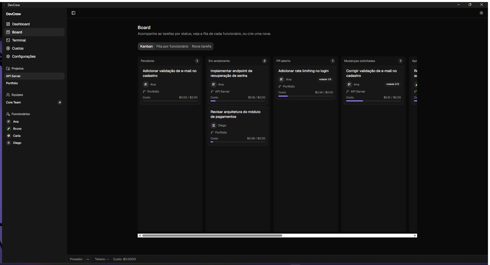
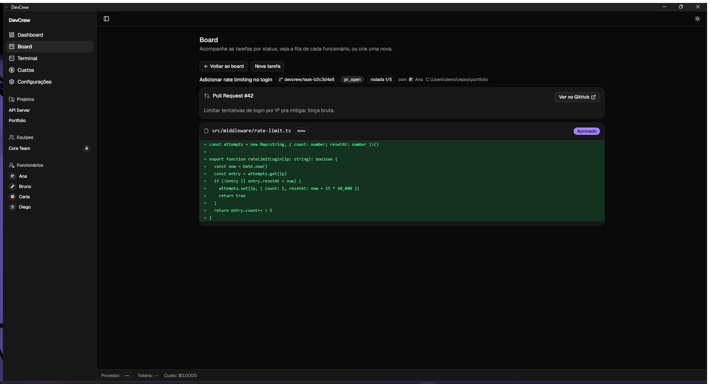
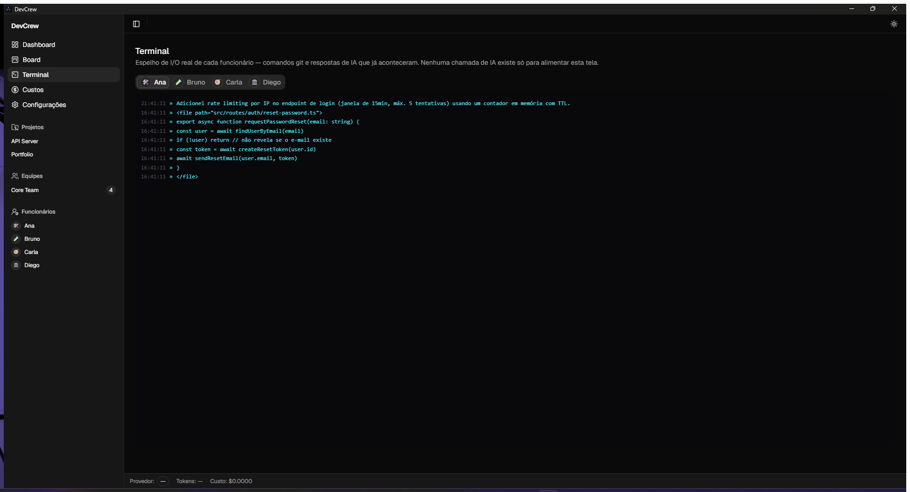
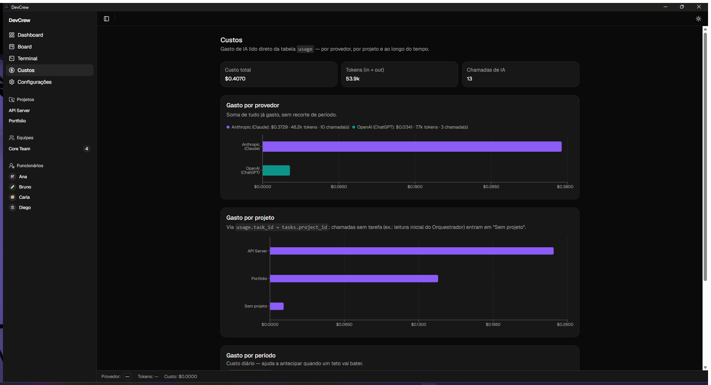
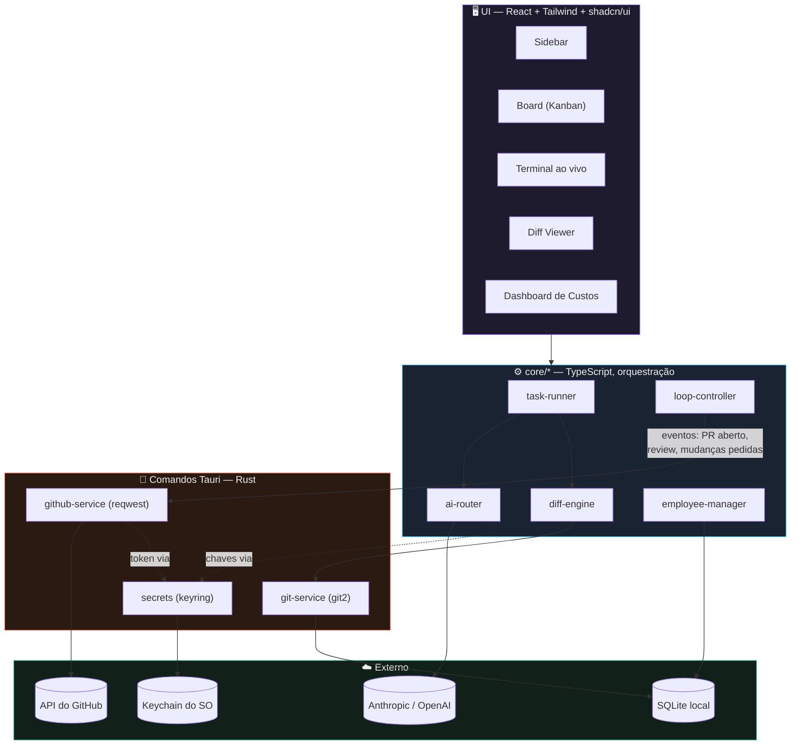

<div align="center">

# 🧑‍💻 DevCrew

### Monte uma equipe de funcionários de IA que trabalha de verdade nos seus repositórios Git

*App desktop (Tauri + React + Rust) onde agentes especializados leem código real, propõem mudanças reais,
abrem Pull Requests reais no GitHub e se revisam entre si — sempre com você no controle.*

[](https://github.com/kevinmistrele/devcrew/actions/workflows/ci.yml)
[](LICENSE)
[](https://v2.tauri.app)
[](https://react.dev)
[](https://www.typescriptlang.org)
[](https://www.rust-lang.org)
[](https://www.sqlite.org)
[](https://www.anthropic.com)
[](https://openai.com)

</div>

---

## O que é

Ferramentas de IA para código hoje costumam ser um chat solto e genérico, ou uma caixa-preta fechada. O
**DevCrew** propõe outra coisa: você monta uma equipe de **funcionários de IA** — cada um com uma função,
um prompt de sistema e um escopo definido de repositórios — e dá tarefas a eles. Eles leem arquivos de
verdade, propõem diffs de verdade, e — quando configurados em equipe — se revisam entre si através de
**eventos reais do GitHub** (PR aberto, review, comentário), num loop Dev ↔ QA autônomo e travado por
segurança. Nada disso é simulado: é git de verdade, PRs de verdade, e a decisão de merge é **sempre sua**.

> Projeto pessoal construído para explorar orquestração multi-agente, integração multi-IA com fallback
> controlado, e as implicações de segurança de dar a um agente de IA acesso de escrita a um repositório.

## Screenshots

<div align="center">

| Board (Kanban) | Diff Viewer |
|---|---|
|  |  |

| Terminal ao vivo | Dashboard de Custos |
|---|---|
|  |  |

*(placeholders — screenshots e GIFs reais entram aqui em `docs/assets/`)*

</div>

## Arquitetura



**O ponto forte é o desacoplamento**: cada provedor de IA implementa a mesma interface (`AIProvider`), então
o `task-runner` nunca sabe — nem precisa saber — se está falando com Claude ou ChatGPT. Toda operação
sensível (Git, chaves de API) roda do lado Rust, fora do WebView; a orquestração (que agente age quando,
tetos de custo, decisão de fallback) vive no TypeScript, onde é rápido iterar.

Diagrama completo de módulos, fluxo de uma tarefa e decisões de design: [`docs/02-arquitetura.md`](docs/02-arquitetura.md).

## Stack

| Camada | Tecnologia | Por quê |
|---|---|---|
| Shell desktop | **Tauri 2** (Rust + WebView) | Binário nativo leve — sem Chromium embutido, sem Electron |
| Frontend | **React 19 + TypeScript + Vite** | Tipagem de ponta a ponta, HMR instantâneo |
| UI | **Tailwind CSS 4 + shadcn/ui (Radix)** | Componentes acessíveis por padrão, tema claro/escuro |
| Gráficos | **Recharts** | Dashboard de custo/uso |
| Git | **git2** (libgit2 via Rust) | Clone, branch, commit, push — sem depender do binário `git` do sistema |
| IA | **SDKs oficiais Anthropic + OpenAI** | Dois provedores atrás de uma única interface |
| GitHub | **reqwest** (Rust) | PRs, reviews, polling de eventos — REST API direto |
| Persistência | **SQLite local** (`tauri-plugin-sql`) | Funcionários, tarefas, histórico, custo — tudo local-first |
| Chaves | **Keychain do SO** (`keyring`) | API keys e tokens nunca tocam o SQLite ou o disco em texto plano |

## Como rodar

**Pré-requisitos:**
- [Node.js](https://nodejs.org) 20+
- [Rust](https://www.rust-lang.org/tools/install) (stable, 1.77+)
- Dependências nativas do Tauri para o seu SO — veja o [guia oficial de pré-requisitos](https://v2.tauri.app/start/prerequisites/) (no Windows, o WebView2 já vem com o Windows 11)

```bash
# clona o repo e instala as dependências do frontend
npm install

# sobe o app desktop em modo dev (hot-reload no front, recompila o Rust quando muda)
npm run tauri dev
```

No primeiro uso, o próprio app te guia: um checklist de onboarding pede pra conectar o **GitHub** (Personal
Access Token) e **pelo menos um provedor de IA** (Anthropic e/ou OpenAI) em Configurações — as chaves vão
direto pro keychain do sistema operacional, nunca para o banco local.

```bash
# build de produção (gera o instalador nativo em src-tauri/target/release/bundle)
npm run tauri build

# só o frontend (sem o shell Tauri) — útil pra iterar rápido na UI
npm run dev

# checagens
npm run lint     # oxlint
npm run build    # tsc --build (checa tipos) + vite build
```

## Destaques técnicos

- **🧑‍🤝‍🧑 Orquestração multi-agente real** — funcionários com papel, prompt de sistema, provedor
  preferido e **escopo de repositório/pasta** próprios; um Orquestrador quebra uma funcionalidade em tasks e
  distribui pro time (Dev ↔ QA), que entra sozinho no loop de revisão. Ver [`docs/07`](docs/07-colaboracao-e-fluxos.md).
- **🔀 Multi-IA com fallback que pergunta, nunca troca sozinho** — o `ai-router` detecta esgotamento de
  quota e **pausa a tarefa perguntando** se você quer continuar com o outro provedor, mostrando tokens
  restantes estimados dos dois lados. Zero surgimento de custo surpresa. Ver [`docs/05`](docs/05-multi-ia-fallback.md).
- **📡 Polling eficiente, não webhook** — um app desktop não tem endereço público pro GitHub chamar, então
  a detecção de eventos (PR aberto, review, push) usa **ETag** (respostas `304` não gastam rate limit) e
  **intervalo adaptativo** (quente logo após atividade, recua pra até 60s+ em repouso) — e só roda enquanto
  existe tarefa ativa no projeto.
- **✅ Aprovação humana em cada ponto de não-retorno** — toda escrita em disco passa por um diff
  verde/vermelho com Aprovar/Rejeitar; commit, push e abertura de PR exigem confirmação explícita; e
  **merge nunca é automatizado** — mesmo com o loop Dev↔QA convergindo sozinho, o clique final é sempre seu.
- **🔒 Chaves nunca em texto plano** — tokens do GitHub e API keys de IA vivem só no keychain nativo do SO
  (Credential Manager / Keychain / Secret Service), nunca no SQLite nem em variável de ambiente do app.
- **🛑 Loop travado por padrão** — todo loop Dev↔QA tem teto de rodadas **e** de custo (configuráveis em
  Configurações); o que bater primeiro pausa a tarefa e abre um modal explicando exatamente onde travou.
- **🌿 Isolamento por branch** — todo trabalho de agente acontece numa branch dedicada da tarefa; escrever
  na `main`/`master` é recusado em duas camadas (TypeScript e no comando Rust que efetivamente toca o disco).
- **🖥️ Terminal ao vivo sem custo de token** — cada funcionário tem sua aba mostrando I/O real de processos
  git (progresso de push vindo direto do `git2`) e o eco de respostas de IA que já aconteceram — nunca uma
  chamada extra só pra narrar a UI.

## Estrutura do projeto

```
src/
  core/            # lógica de domínio (TS) — git-service, github-service, ai-router,
                    # task-runner, loop-controller, diff-engine, employee-manager, db...
  ui/               # componentes compostos (task-board, terminal, diff-viewer, modais...)
  pages/            # uma página por rota
  components/ui/    # primitivos shadcn/ui
src-tauri/
  src/              # comandos Rust — git.rs, github.rs, secrets.rs
  migrations/       # schema SQLite versionado
docs/               # documentação de arquitetura, modelo de dados, fluxos (índice em docs/README.md)
```

## Documentação completa

Este README é a vitrine — o raciocínio completo de produto e arquitetura está em [`docs/`](docs/README.md):
visão geral, arquitetura, modelo de dados, multi-IA/fallback, interface e os fluxos de colaboração entre
agentes.

## Roadmap

O projeto foi construído em fases incrementais, cada uma entregando algo utilizável antes de avançar — do
esqueleto (Fase 0) ao MVP de um funcionário só (Fase 1), multi-IA com fallback (Fase 2), equipe colaborando
via eventos reais do GitHub (Fase 3), até o polimento de portfólio — onboarding, tema, dashboard de custo,
este README (Fase 4). Detalhes em [`docs/03-roadmap.md`](docs/03-roadmap.md).

## Licença

[MIT](LICENSE).
